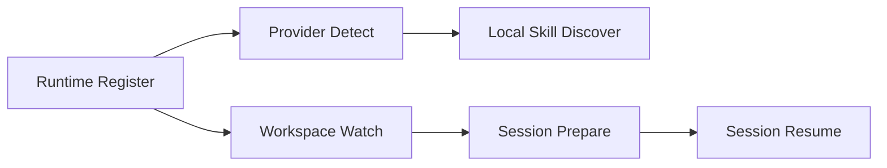

# Runtime Bridge Core Developer Guide

**Maturity Tier:** `Hardened`

## Purpose And Architecture Role

`runtime-bridge-core` is the governed daemon and local-runtime bridge for the Gutu AI stack. It captures runtime registration, watched workspaces, detected providers, local skill discovery, and resumable session state so higher-level packs can bridge into machine-local execution without hiding control flow in ambient process state.

## Repo Map

| Path | Role |
| --- | --- |
| `framework/builtin-plugins/runtime-bridge-core` | Publishable plugin package. |
| `framework/builtin-plugins/runtime-bridge-core/src` | Actions, resources, services, policies, and admin UI exports. |
| `framework/builtin-plugins/runtime-bridge-core/tests` | Unit, contract, integration, and migration coverage. |
| `framework/builtin-plugins/runtime-bridge-core/db/schema.ts` | Durable schema for runtimes, watched workspaces, providers, local skills, and sessions. |
| `framework/builtin-plugins/runtime-bridge-core/docs` | Internal supporting domain docs for runtime bridging and recovery rules. |

## Manifest Contract

| Field | Value |
| --- | --- |
| Package Name | `@plugins/runtime-bridge-core` |
| Manifest ID | `runtime-bridge-core` |
| Display Name | Runtime Bridge Core |
| Kind | `plugin` |
| Review Tier | `R1` |
| Isolation Profile | `same-process-trusted` |

## Dependency Graph And Capability Requests

| Type | Value |
| --- | --- |
| Depends On | `auth-core`, `org-tenant-core`, `role-policy-core`, `audit-core`, `execution-workspaces-core`, `integration-core` |
| Requested Capabilities | `ui.register.admin`, `api.rest.mount`, `data.write.runtime` |
| Provides Capabilities | `runtime.runtimes`, `runtime.local-skills`, `runtime.sessions` |
| Owns Data | `runtime.runtimes`, `runtime.watched-workspaces`, `runtime.provider-detections`, `runtime.local-skills`, `runtime.sessions` |

## Public Integration Surfaces

| Kind | ID | Purpose |
| --- | --- | --- |
| Action | `runtime.runtimes.register` | Registers or updates a runtime bridge endpoint. |
| Action | `runtime.daemons.heartbeat` | Refreshes runtime health and heartbeat posture. |
| Action | `runtime.workspaces.watch` | Registers a watched workspace and sync posture. |
| Action | `runtime.providers.detect` | Stores provider-detection state for the runtime. |
| Action | `runtime.skills.discover` | Stores local skill discovery state exposed by the runtime. |
| Action | `runtime.sessions.prepare` | Creates a resumable runtime session record. |
| Action | `runtime.sessions.resume` | Resumes a runtime session and refreshes timestamps. |
| Resource | `runtime.runtimes` | Runtime and daemon registry. |
| Resource | `runtime.watched-workspaces` | Watched workspace state and sync posture. |
| Resource | `runtime.provider-detections` | Provider detection and configuration inventory. |
| Resource | `runtime.local-skills` | Locally discovered skill sources. |
| Resource | `runtime.sessions` | Resumable runtime session metadata. |
| Builder | `runtime-bridge-builder` | Runtime bridge policy and watch posture builder. |

## Hooks, Events, And Orchestration

- `runtime-bridge-core` is action-first and keeps machine-local state explicit.
- Runtime sessions are durable records rather than implicit byproducts of local processes.
- Provider detection and local skill discovery are typed records so higher-level plugins can import or validate them safely.

## Storage, Schema, And Migration Notes

- Schema file: `framework/builtin-plugins/runtime-bridge-core/db/schema.ts`
- Durable records cover runtimes, watched workspaces, provider detections, local skill sources, and runtime sessions.
- The runtime implementation persists fixture-backed JSON state through `@platform/ai-runtime`, while the schema expresses the stable relational contract for future adapters.

## Failure Modes And Recovery

- Unknown runtimes cannot be heartbeated, watched, or used for session preparation.
- Session resume fails closed when the session record does not exist for the tenant.
- Watched workspace updates are idempotent by watch ID, preventing duplicate registrations.
- Provider and skill discovery use upserts so repeated runtime scans converge on the latest state.

## Mermaid Flows



## Integration Recipes

```ts
import { registerRuntime, discoverLocalSkill, prepareRuntimeSession } from "@plugins/runtime-bridge-core";

registerRuntime({
  tenantId: "tenant-platform",
  actorId: "actor-admin",
  runtimeId: "runtime:local-dev",
  label: "Local Dev Runtime",
  transport: "daemon",
  endpoint: "unix:///tmp/gutu-runtime.sock",
  ownerActorId: "actor-admin",
  profile: "default",
  capabilities: ["watch", "resume", "local-skills"]
});

discoverLocalSkill({
  tenantId: "tenant-platform",
  actorId: "actor-admin",
  runtimeId: "runtime:local-dev",
  sourceId: "local-skill:ops-triage",
  skillKey: "ops-triage",
  label: "Ops Triage",
  version: "v1",
  schemaRef: "schema://local-skills/ops-triage"
});

prepareRuntimeSession({
  tenantId: "tenant-platform",
  actorId: "actor-admin",
  sessionRecordId: "runtime-session:ops-1",
  runtimeId: "runtime:local-dev",
  sessionId: "session:ops-1",
  workDir: "/workspaces/ops-1"
});
```

## Test Matrix

- Unit: manifest invariants plus services for runtime registration, watch state, discovery, and resume
- Contracts: admin contributions and UI surface routes
- Integration: runtime register -> detect -> watch -> local skill -> session prepare -> session resume
- Migrations: schema coverage for every owned table contract

## Current Truth And Recommended Next

- Current truth: `runtime-bridge-core` closes the biggest Multica-class runtime ergonomics gap by making daemon, watch, and resume state explicit.
- Recommended next: add real daemon transport adapters, log ingestion, and stronger policy controls once the contract surface freezes.
