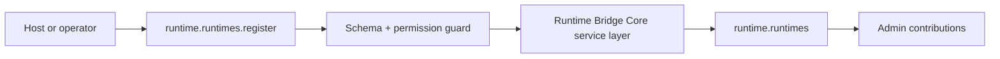

# Runtime Bridge Core Developer Guide

Governed daemon, watched workspace, local skill, and resumable session contracts for local runtime bridging.

**Maturity Tier:** `Hardened`

## Purpose And Architecture Role

Bridges governed platform workflows into external runtimes and service boundaries without leaking orchestration assumptions into every plugin.

### This plugin is the right fit when

- You need **runtime bridges**, **service handoff**, **governed orchestration** as a governed domain boundary.
- You want to integrate through declared actions, resources, jobs, workflows, and UI surfaces instead of implicit side effects.
- You need the host application to keep plugin boundaries honest through manifest capabilities, permissions, and verification lanes.

### This plugin is intentionally not

- Not an everything-and-the-kitchen-sink provider abstraction layer.
- Not a substitute for explicit approval, budgeting, and audit governance in the surrounding platform.

## Repo Map

| Path | Purpose |
| --- | --- |
| `package.json` | Root extracted-repo manifest, workspace wiring, and repo-level script entrypoints. |
| `framework/builtin-plugins/runtime-bridge-core` | Nested publishable plugin package. |
| `framework/builtin-plugins/runtime-bridge-core/src` | Runtime source, actions, resources, services, and UI exports. |
| `framework/builtin-plugins/runtime-bridge-core/tests` | Unit, contract, integration, and migration coverage where present. |
| `framework/builtin-plugins/runtime-bridge-core/docs` | Internal domain-doc source set kept in sync with this guide. |
| `framework/builtin-plugins/runtime-bridge-core/db/schema.ts` | Database schema contract when durable state is owned. |
| `framework/builtin-plugins/runtime-bridge-core/src/postgres.ts` | SQL migration and rollback helpers when exported. |

## Manifest Contract

| Field | Value |
| --- | --- |
| Package Name | `@plugins/runtime-bridge-core` |
| Manifest ID | `runtime-bridge-core` |
| Display Name | Runtime Bridge Core |
| Domain Group | AI Systems |
| Default Category | AI & Automation / Runtime Bridges |
| Version | `0.1.0` |
| Kind | `plugin` |
| Trust Tier | `first-party` |
| Review Tier | `R1` |
| Isolation Profile | `same-process-trusted` |
| Framework Compatibility | ^0.1.0 |
| Runtime Compatibility | bun>=1.3.12 |
| Database Compatibility | postgres, sqlite |

## Dependency Graph And Capability Requests

| Field | Value |
| --- | --- |
| Depends On | `auth-core`, `org-tenant-core`, `role-policy-core`, `audit-core`, `execution-workspaces-core`, `integration-core` |
| Recommended Plugins | None |
| Capability Enhancing | None |
| Integration Only | None |
| Suggested Packs | None |
| Standalone Supported | Yes |
| Requested Capabilities | `ui.register.admin`, `api.rest.mount`, `data.write.runtime` |
| Provides Capabilities | `runtime.runtimes`, `runtime.local-skills`, `runtime.sessions` |
| Owns Data | `runtime.runtimes`, `runtime.watched-workspaces`, `runtime.provider-detections`, `runtime.local-skills`, `runtime.sessions` |

### Dependency interpretation

- Direct plugin dependencies describe package-level coupling that must already be present in the host graph.
- Requested capabilities tell the host what platform services or sibling plugins this package expects to find.
- Provided capabilities and owned data tell integrators what this package is authoritative for.

## Public Integration Surfaces

| Type | ID / Symbol | Access / Mode | Notes |
| --- | --- | --- | --- |
| Action | `runtime.runtimes.register` | Permission: `runtime.runtimes.register` | Idempotent<br>Audited |
| Action | `runtime.daemons.heartbeat` | Permission: `runtime.daemons.heartbeat` | Idempotent<br>Audited |
| Action | `runtime.workspaces.watch` | Permission: `runtime.workspaces.watch` | Idempotent<br>Audited |
| Action | `runtime.providers.detect` | Permission: `runtime.providers.detect` | Idempotent<br>Audited |
| Action | `runtime.skills.discover` | Permission: `runtime.skills.discover` | Idempotent<br>Audited |
| Action | `runtime.sessions.prepare` | Permission: `runtime.sessions.prepare` | Idempotent<br>Audited |
| Action | `runtime.sessions.resume` | Permission: `runtime.sessions.resume` | Idempotent<br>Audited |
| Resource | `runtime.runtimes` | Portal disabled | Runtime and daemon registry for local and remote execution bridges.<br>Purpose: Keep runtime health, ownership, and capability posture visible and auditable.<br>Admin auto-CRUD enabled<br>Fields: `label`, `status`, `transport`, `ownerActorId`, `lastHeartbeatAt` |
| Resource | `runtime.watched-workspaces` | Portal disabled | Watched workspace records attached to runtime bridges.<br>Purpose: Track which repos and workspaces a runtime owns and how it syncs them.<br>Admin auto-CRUD enabled<br>Fields: `repoRef`, `host`, `runtimeId`, `status`, `syncMode`, `policyStatus`, `lastSyncedAt` |
| Resource | `runtime.provider-detections` | Portal disabled | Detected or configured model and coding providers for a runtime.<br>Purpose: Keep provider auto-detect and configuration drift visible in the runtime bridge.<br>Admin auto-CRUD enabled<br>Fields: `runtimeId`, `providerId`, `status`, `detectedAt` |
| Resource | `runtime.local-skills` | Portal disabled | Locally discovered skills exposed by a runtime bridge.<br>Purpose: Make local skill discovery visible and importable instead of hiding it in runtime-specific metadata.<br>Admin auto-CRUD enabled<br>Fields: `label`, `runtimeId`, `status`, `importedSkillId`, `lastSeenAt` |
| Resource | `runtime.sessions` | Portal disabled | Resumable runtime session records linked to watched workspaces or issues.<br>Purpose: Keep session resume posture durable so local runtime recovery stays auditable.<br>Admin auto-CRUD enabled<br>Fields: `runtimeId`, `sessionId`, `status`, `issueId`, `updatedAt` |


### UI Surface Summary

| Surface | Present | Notes |
| --- | --- | --- |
| UI Surface | Yes | A bounded UI surface export is present. |
| Admin Contributions | Yes | Additional admin workspace contributions are exported. |
| Zone/Canvas Extension | No | No dedicated zone extension export. |

## Hooks, Events, And Orchestration

This plugin should be integrated through **explicit commands/actions, resources, jobs, workflows, and the surrounding Gutu event runtime**. It must **not** be documented as a generic WordPress-style hook system unless such a hook API is explicitly exported.

- No standalone plugin-owned lifecycle event feed is exported today.
- No plugin-owned job catalog is exported today.
- No plugin-owned workflow catalog is exported today.
- Recommended composition pattern: invoke actions, read resources, then let the surrounding Gutu command/event/job runtime handle downstream automation.

## Storage, Schema, And Migration Notes

- Database compatibility: `postgres`, `sqlite`
- Schema file: `framework/builtin-plugins/runtime-bridge-core/db/schema.ts`
- SQL helper file: `framework/builtin-plugins/runtime-bridge-core/src/postgres.ts`
- Migration lane present: Yes

The plugin does not export a dedicated SQL helper module today. Treat the schema and resources as the durable contract instead of inventing undocumented SQL behavior.

## Failure Modes And Recovery

- Action inputs can fail schema validation or permission evaluation before any durable mutation happens.
- If downstream automation is needed, the host must add it explicitly instead of assuming this plugin emits jobs.
- There is no separate lifecycle-event feed to rely on today; do not build one implicitly from internal details.
- Schema regressions are expected to show up in the migration lane and should block shipment.

## Mermaid Flows

### Primary Lifecycle




## Integration Recipes

### 1. Host wiring

```ts
import { manifest, registerRuntimeAction, RuntimeResource, adminContributions, uiSurface } from "@plugins/runtime-bridge-core";

export const pluginSurface = {
  manifest,
  registerRuntimeAction,
  RuntimeResource,
  
  
  adminContributions,
  uiSurface
};
```

Use this pattern when your host needs to register the plugin’s declared exports without reaching into internal file paths.

### 2. Action-first orchestration

```ts
import { manifest, registerRuntimeAction } from "@plugins/runtime-bridge-core";

console.log("plugin", manifest.id);
console.log("action", registerRuntimeAction.id);
```

- Prefer action IDs as the stable integration boundary.
- Respect the declared permission, idempotency, and audit metadata instead of bypassing the service layer.
- Treat resource IDs as the read-model boundary for downstream consumers.

### 3. Cross-plugin composition

- Compose this plugin through action invocations and resource reads.
- If downstream automation becomes necessary, add it in the surrounding Gutu command/event/job runtime instead of assuming this plugin already exports a hook surface.

## Test Matrix

| Lane | Present | Evidence |
| --- | --- | --- |
| Build | Yes | `bun run build` |
| Typecheck | Yes | `bun run typecheck` |
| Lint | Yes | `bun run lint` |
| Test | Yes | `bun run test` |
| Unit | Yes | 2 file(s) |
| Contracts | Yes | 2 file(s) |
| Integration | Yes | 1 file(s) |
| Migrations | Yes | 1 file(s) |

### Verification commands

- `bun run build`
- `bun run typecheck`
- `bun run lint`
- `bun run test`
- `bun run test:contracts`
- `bun run test:integration`
- `bun run test:migrations`
- `bun run test:unit`
- `bun run docs:check`

## Current Truth And Recommended Next

### Current truth

- Exports 7 governed actions: `runtime.runtimes.register`, `runtime.daemons.heartbeat`, `runtime.workspaces.watch`, `runtime.providers.detect`, `runtime.skills.discover`, `runtime.sessions.prepare`, `runtime.sessions.resume`.
- Owns 5 resource contracts: `runtime.runtimes`, `runtime.watched-workspaces`, `runtime.provider-detections`, `runtime.local-skills`, `runtime.sessions`.
- Adds richer admin workspace contributions on top of the base UI surface.
- Defines a durable data schema contract even though no explicit SQL helper module is exported.

### Current gaps

- No standalone plugin-owned event, job, or workflow catalog is exported yet; compose it through actions, resources, and the surrounding Gutu runtime.
- The repo does not yet export a domain parity catalog with owned entities, reports, settings surfaces, and exception queues.

### Recommended next

- Deepen runtime observability and failure recovery patterns as more production workflows depend on bridge handoffs.
- Clarify adapter stability and compatibility boundaries before expanding bridge coverage further.
- Add deeper provider, persistence, or evaluation integrations only where the shipped control-plane contracts already prove stable.
- Expand operator diagnostics and release gating where the current lifecycle already exposes strong evidence paths.
- Promote important downstream reactions into explicit commands, jobs, or workflow steps instead of relying on implicit coupling.

### Later / optional

- More connector breadth, richer evaluation libraries, and domain-specific copilots after the baseline contracts settle.
